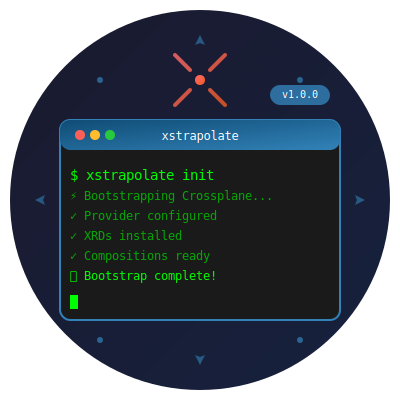

# xstrapolate

<div align="center">



[](https://github.com/yourusername/xstrapolate/releases)
[](LICENSE)
[](https://goreportcard.com/report/github.com/yourusername/xstrapolate)

**A powerful CLI tool for bootstrapping and managing Crossplane configurations**

</div>

## 📋 Overview

xstrapolate simplifies the process of bootstrapping Crossplane environments by automating provider configuration, XRD installation, and composition deployment.

## 🚀 Quick Start

```bash
# Install xstrapolate
go install github.com/yieldllc/xstrapolate@latest

# Initialize a new Crossplane environment
xstrapolate init

# Deploy compositions
xstrapolate deploy
```

## ✨ Features

- ⚡ **Fast Bootstrap** - Get Crossplane up and running in minutes
- 🔧 **Provider Management** - Automatically configure and install providers
- 📦 **XRD Installation** - Streamlined XRD deployment process
- 🎯 **Composition Ready** - Deploy compositions with a single command
- 🔄 **Hot Reload** - Watch and apply changes automatically

## 📖 Documentation

For detailed documentation, visit [our docs](https://docs.example.com/xstrapolate)

## 🤝 Contributing

Contributions are welcome! Please read our [Contributing Guide](CONTRIBUTING.md) for details.

## 📄 License

This project is licensed under the MIT License - see the [LICENSE](LICENSE) file for details.

---

<div align="center">
Made with ❤️ by the Crossplane Community
</div>